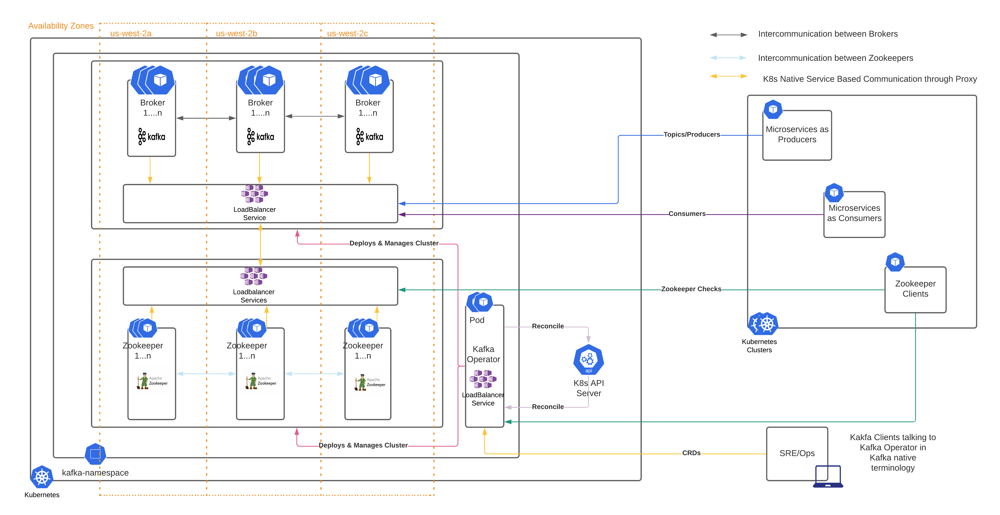
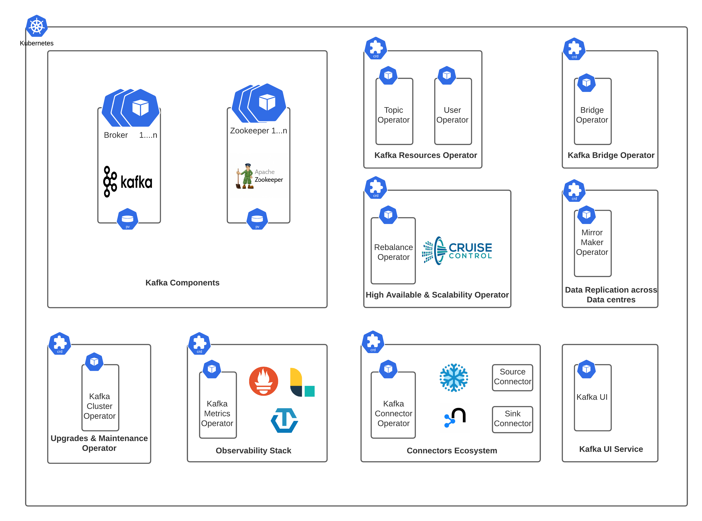

# kafka-on-k8s
Managing and Deploying Kafka on K8s using Strimzi

[](https://strimzi.io/)

## Introduction

This repository contains all the POCs and research related to the Kafka Deployment.

Kafka is essentially a commit log with a simple data structure. The Kafka Producer API, Consumer API, Streams API, and Connect API can be used to manage the platform, and the Kafka cluster architecture is made up of Brokers, Consumers, Producers, and ZooKeeper.

A cluster of Kafka brokers handles the delivery of messages. A broker uses Apache ZooKeeper for storing configuration data and for cluster coordination. Before running Apache Kafka, an Apache ZooKeeper cluster has to be ready. Each of the other Kafka components interacts with the Kafka cluster to perform specific roles.

## Strimzi

Strimzi provides a way to run an Apache Kafka cluster on Kubernetes in various deployment configurations. For development, it’s easy to set up a cluster in Minikube/KinD in a few minutes. For production we can tailor the cluster to our needs, using features such as rack awareness to spread brokers across availability zones, and Kubernetes taints and tolerations to run Kafka on dedicated nodes.

We expose Kafka outside Kubernetes using Internal Load balancer and these are easily secured using TLS.

The Kube-native management of Kafka is not limited to the broker. We can also manage Kafka topics, users, Kafka MirrorMaker, and Kafka Connect using Custom Resources. This means we can use our familiar Kubernetes processes and tools to manage complete Kafka applications.

Strimzi provides container images and Operators for running Kafka on Kubernetes. Strimzi Operators are fundamental to the running of Strimzi. The Operators provided with Strimzi are purpose-built with specialist operational knowledge to effectively manage Kafka.

## Design


## Ecosystem


## Project Layout

The starter kit uses the following project layout:

```
.
├── README.md
├── Steps
│   ├── All Detailed Steps
├── assets
│   ├── Kafka-Architecture.png
│   ├── Kafka-Components.png
│   └── strimzi.png
├── client
│   ├── go-client
│   │   ├── Mutual-TLS
│   │   ├── SCRAM-SHA-TLS
│   │   └── Server-TLS
│   ├── k8s-deployment
│   │   └── kafka-producer.yaml
│   └── kafka-client.yaml
├── crds
│   ├── cluster-crd
│   │   ├── kafka-cluster-cruise-control.yaml
│   │   ├── kafka-cluster-internal-nlb.yaml
│   │   ├── kafka-cluster-mtls.yaml
│   │   ├── kafka-cluster-nlb.yaml
│   │   ├── kafka-cluster-pod-antiaffinity.yaml
│   │   ├── kafka-cluster-scram.yaml
│   │   ├── kafka-cluster-tls-authorize.yaml
│   │   └── kafka-cluster-tls.yaml
│   ├── cruise-control-crd
│   │   ├── kafka-rebalance-with-goals.yaml
│   │   └── kafka-rebalance.yaml
│   ├── mirrormaker-crd
│   │   └── kafka-mirror-maker-2.yaml
│   │   ├── kafka-cluster-source.yaml
│   │   ├── kafka-cluster-target.yaml
│   ├── topic-crd
│   │   └── kafka-topic.yaml
│   └── user-crd
│       ├── kafka-user.yaml
│       ├── mtls-auth-user.yaml
│       ├── scram-user.yaml
│       ├── tls-author-user-test.yaml
│       └── tls-author-user.yaml
├── kafka-ui
│   ├── kowl
├── load-testing
│   ├── Kafka.jmx
│   ├── bulk-topics-create.sh
│   └── bulk-topics-delete.sh
└── operator-package
    └── strimzi
        ├── Complete Operator Package
```
